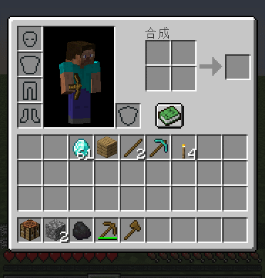
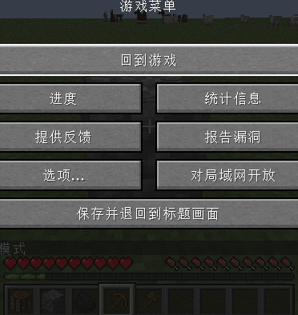

**This mod allows you to get a small amount of experience points by mining and crafting.**

## Features:

* You can configure how many and how often you will get experience points
* You can add blocks and items to blacklist, and you'll not get any experience points for mining and crafting those blocks and items

## Examples

## Installation

* Install Forge
* Navigate to your .minecraft folder
* Download the mod and place the jar file in .minecraft/mods
* Delete old config file from the previous mod versions
    * For 1.12.2 - getexpforeverything.cfg file in .minecraft/config or in-game config menu
    * For 1.14 and above - getexpforeverything-common.toml file in .minecraft/config
* Play!

## Modpacks

Yes, you can use this mod in your modpack. I'd prefer if you provide a link to the mod's CurseForge page, but that's up to you.